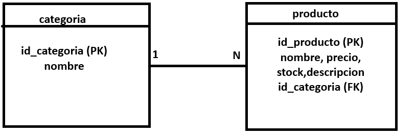

## Integrantes del grupo

- Merlina López — merlilopez72@gmail.com
- Santino Faccioli Vanini — santino.faccioli@gmail.com
##descripción deltrabajo:
El sitio web *NutriPoint* permite a los usuarios visualizar los productos de la dietética de manera pública.  
Los visitantes pueden explorar los productos organizados por categorías (Sin TACC, Veganos, Harinas, Lácteos, Frutos secos, etc.), ver precios, stock y descripción de cada producto.

El acceso administrativo está reservado a los usuarios con rol de administrador, quienes pueden crear, modificar o eliminar tanto categorías como productos.  

## Modelo de datos
A continuación se muestra el Diagrama Entidad-Relación (DER) de nuestra base de datos:

## El script SQL que genera la base de datos se encuentra en el archivo `db_nutripoint.sql`.

El modelo de datos se compone de dos entidades principales:

**Categoría**  
- Representa los distintos grupos de productos de la dietética (ej: Sin TACC, Veganos, Harinas, Lácteos, Frutos secos).  
- Clave primaria: `id_categoria` (PK).

**Producto**  
- Almacena la información de cada producto: nombre, precio, stock y descripción.  
- Clave primaria: `id_producto` (PK).  
- Clave foránea: `id_categoria` (FK), que lo vincula con una categoría.

**Relación**  
- Una Categoría puede contener muchos Productos (1 → N).  
- Un Producto pertenece únicamente a una Categoría.

Este diseño asegura que cada producto esté correctamente organizado dentro de una categoría, garantizando consistencia y facilidad en las consultas.
